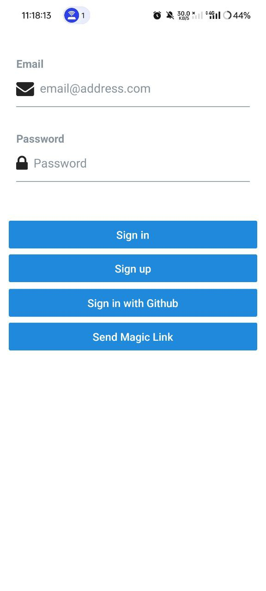
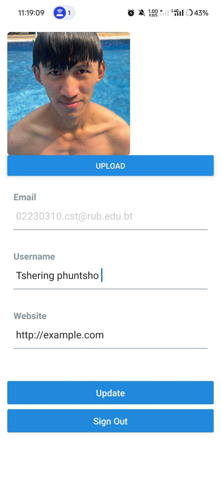
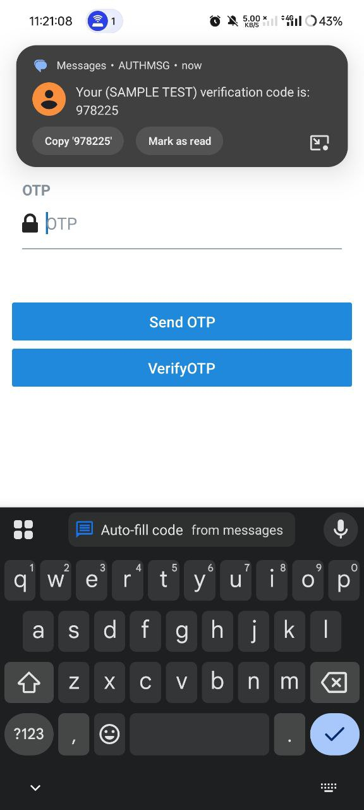
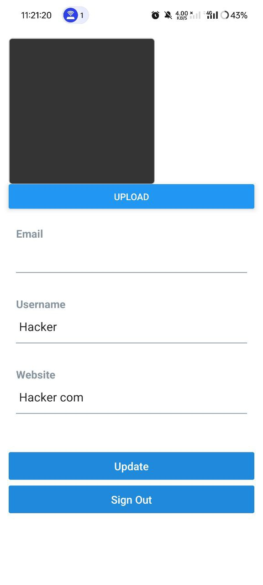

# Authentication Practical Report

## 1. What I Have Done
In this practical, I developed a **React Native mobile authentication app** using **Expo** and **Supabase**. The application supports multiple authentication methods:

- Email and Password Login & Sign-Up  
- Passwordless Authentication using Magic Link  
- OTP-based Authentication  
- GitHub OAuth Login  

I created the OTP login in different project, where magic link and Github OAuth login in integrated in the same project with email and password login & sign-up.

### Email and Password login plus magic link and Sign in with Github
    
### After successfully signing in 

### OTP Authentication

### The OTP 

### Successfully logged in

## 2. What I Have Learnt
During the development process, I learned:

- How to integrate Supabase Auth in a React Native app  
- How to implement different types of authentication (traditional, magic link, OTP, and OAuth)  
- Working with React Navigation for screen transitions  
- Using Expo CLI and running apps on emulators and physical devices  
- How to handle async API calls 
- Managing authentication flow securely in a mobile environment  

## 3. What Challenges I Have Faced
Some of the challenges I encountered included:

- Difficulty with setting up Android SDK for local emulator  
- Trouble integrating `expo-router` and navigation between screens  
- `Network request failed` and `(NOBRIDGE)` errors while testing on Expo Go  
- Supabase Magic Link and OTP sometimes not triggering due to email setup  
- Facing issues importing and using `useRouter()` from `expo-router`  

## 4. How Did I Overcome

I overcame these challenges through:

- Switching to Expo Go on a physical device instead of emulator for faster testing  
- Reading Supabase documentation and checking error logs in the console  
- Breaking features down and testing one authentication method at a time  
- Asking for help online and using community platforms like StackOverflow, GitHub, and ChatGPT  
- Falling back to React Navigation instead of `expo-router` when it didn’t work properly  
- Ensuring email provider (like Gmail) was working for Magic Link and OTP delivery  
